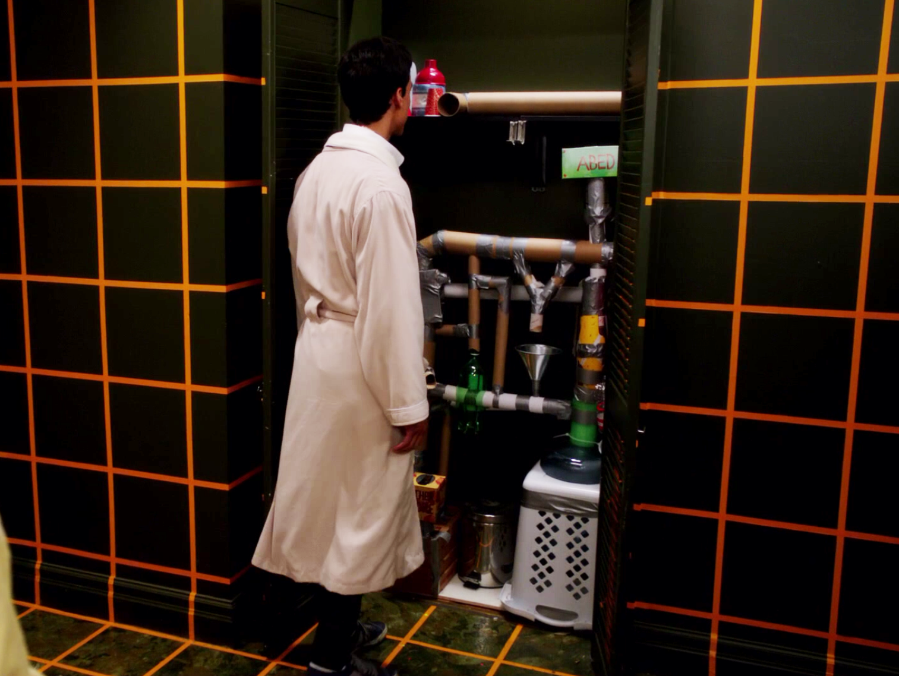

# Dreamatorium



## Prerequisites
+ [Ruby Gems](rubygems.org)
+ [Vagrant](http://www.vagrantup.com/downloads.html)
+ [Virtualbox](https://www.virtualbox.org/wiki/Downloads)
+ [Vagrant Hostsupdater](https://github.com/cogitatio/vagrant-hostsupdater)

## Getting Started
1. Clone the project.
2. Run `vagrant plugin install vagrant-hostsupdater` from command line
3. Run `gem install` from command line
4. Run the command `vagrant up` from the directory
5. Open your browser to `http://moonbase.dev`
6. Finish wordpress Installation

## What's Installed

+ Ubuntu Trusty 14.04 - **Done**
+ Nvm - Node/io.js version manager - **Done**
+ Oh My ZSH - **Done**
+ Elastic Search - Buggy but **Done**
+ Nginx - **Done**
+ Wordpress 4.0 - **Done**
+ WP-CLI - **Done**
+ Mysql - **Done**
+ Mongodb -
+ Postgres -
+ MariaDB -
+ Laravel -
+ LiveReload -
+ Gulp
+ Export Scripts
+ Import Scripts
+ Php - **Done**
+ Phpmyadmin - **Done**
+ Git - **Done**
+ Composer - **Done**
+ ~~PEAR~~
+ Xdebug - **Done**
+ PHPUnit - *installed via composer* - **Done**
+ phploc - *installed via composer* - **Done**
+ phpcpd - *installed via composer* - **Done**
+ phpdcd - *installed via composer* - **Done**
+ phpcs - *installed via composer* - **Done**
+ phpdepend - *installed via composer* - **Done**
+ phpmd - *installed via composer* - **Done**
+ PHP_CodeBrowser - *installed via composer* - **Done**
+ WordPress sniffs for phpcs - **Done**
+ WordPress Unit Tests - *installed via composer* - **Done**


*PEAR removed as support has reached end of life, see [End of Life for PEAR Installation Method](https://github.com/sebastianbergmann/phpunit/wiki/End-of-Life-for-PEAR-Installation-Method)*

## Roadmap
+ Tests
+ Seperation of services
+ Finalizing Configuration
+ Persistant data storage
+ Yaml based config file


## phpMyAdmin
```
http://moonbase.dev/phpmyadmin/
username: wordpress
password: wordpress
```
## Notes
If you're needing a password (for anything - including mysql, it should be `vagrant`)
